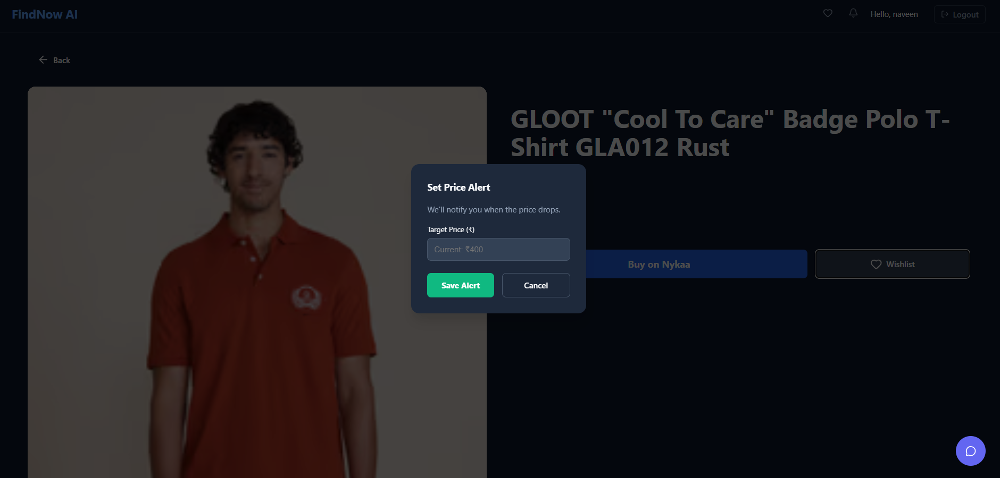

# FindNow - AI-Powered Product Analysis & Comparison


**FindNow** is a cutting-edge web application designed to revolutionize the online shopping experience. By leveraging advanced web scraping and Artificial Intelligence, FindNow provides users with real-time product data, in-depth sentiment analysis of customer reviews, and intelligent product comparisons.

State-of-the-art AI models (Google Gemini / OpenAI) analyze thousands of reviews to give you a clear "Buy" or "Don't Buy" recommendation, saving you hours of research.

---

## 🚀 Key Features

*   **🕵️‍♂️ Real-time Scraping Engine**: Automatically extracts live product details, pricing, and availability from major e-commerce platforms like Amazon.
*   **🧠 AI-Driven Sentiment Analysis**: sophisticated natural language processing translates complex user reviews into simple, actionable insights (Positive vs. Negative sentiment).
*   **⚖️ Smart Product Comparison**: Side-by-side comparison of features, prices, and AI ratings to help you find the best value.
*   **📊 Visual Decision Aids**: Interactive pie charts and summary metrics make understanding data at a glance effortless.
*   **🤖 Intelligent Chat Assistant**: A built-in chatbot that understands context and helps guide your shopping journey.
*   **🔔 Price Alerts**: (Planned) Get notified when your favorite products drop in price.

---

## 🛠️ Technology Stack

### **Frontend**
*   **Framework**: [React](https://react.dev/) (powered by [Vite](https://vitejs.dev/) for lightning-fast HMR)
*   **Styling**: CSS Modules / Styled Components approach
*   **Data Visualization**: [Recharts](https://recharts.org/) for analytics charts
*   **Icons**: [Lucide React](https://lucide.dev/) for a modern icon set
*   **Routing**: React Router DOM

### **Backend**
*   **Runtime**: Node.js & Express
*   **Database**: [Supabase](https://supabase.com/) (PostgreSQL)
*   **Web Scraping**: 
    *   [Puppeteer](https://pptr.dev/) (with Stealth Plugin to evade detection)
    *   [Cheerio](https://cheerio.js.org/) for lightweight HTML parsing
*   **AI Integration**: Google Generative AI (Gemini Pro) or OpenAI API for review analysis

---

## 📂 Project Structure

```bash
FindNow/
├── frontend/           # Client-side React application
│   ├── src/
│   │   ├── components/ # Reusable UI components (Navbar, Charts, etc.)
│   │   ├── pages/      # Application route pages (Login, ProductDetail, etc.)
│   │   ├── context/    # Global state management
│   │   └── api.js      # Centralized API configuration
│   └── .env            # Frontend environment variables
│
├── backend/            # Server-side Node.js application
│   ├── routes/         # API Route definitions
│   ├── scraper/        # Scraper logic for different e-com sites
│   ├── index.js        # Server entry point
│   └── .env            # Backend secrets and keys
│
└── README.md           # Documentation
```

---

## 🏁 Getting Started

Follow these steps to set up the project locally.

### Prerequisites
*   **Node.js** (v18+)
*   **npm** or yarn
*   **Supabase Account** (for database & auth)
*   **Google Cloud Console** (for Gemini API Key)

### Installation

1.  **Clone the Repository**
    ```bash
    git clone https://github.com/Bhartinaveen/Findone.git
    cd FindNow
    ```

2.  **Backend Setup**
    Navigate to the backend folder and install dependencies:
    ```bash
    cd backend
    npm install
    ```

    Create a `.env` file in `backend/`:
    ```env
    PORT=5000
    SUPABASE_URL=your_supabase_project_url
    SUPABASE_KEY=your_supabase_anon_key
    GEMINI_API_KEY=your_gemini_api_key
    # OPENAI_API_KEY=optional_openai_key
    ```
    Start the backend server:
    ```bash
    npm start
    # Output: Server is running on port 5000
    ```

3.  **Frontend Setup**
    Open a new terminal, navigate to the frontend folder:
    ```bash
    cd frontend
    npm install
    ```

    Create a `.env` file in `frontend/`:
    ```env
    VITE_API_URL=http://localhost:5000/api
    ```
    *Note: This ensures the frontend connects to your local backend.*

    Start the frontend development server:
    ```bash
    npm run dev
    ```

4.  **Launch**
    Open `http://localhost:5173` in your browser.

---

## 📸 Screenshots

### Home & Search


### AI Product Analysis


### Wishlist


### Chatbot Interface
<div style="display: flex; gap: 10px;">
  
  
  
</div>

---

## 🤝 Contributing

Contributions are what make the open-source community such an amazing place to learn, inspire, and create. Any contributions you make are **greatly appreciated**.

1.  Fork the Project
2.  Create your Feature Branch (`git checkout -b feature/AmazingFeature`)
3.  Commit your Changes (`git commit -m 'Add some AmazingFeature'`)
4.  Push to the Branch (`git push origin feature/AmazingFeature`)
5.  Open a Pull Request

---

## 📜 License

Distributed under the MIT License. See `LICENSE` for more information.

---

<p align="center">
  Made with ❤️ by <a href="https://github.com/Bhartinaveen">Bharti Naveen</a>
</p>