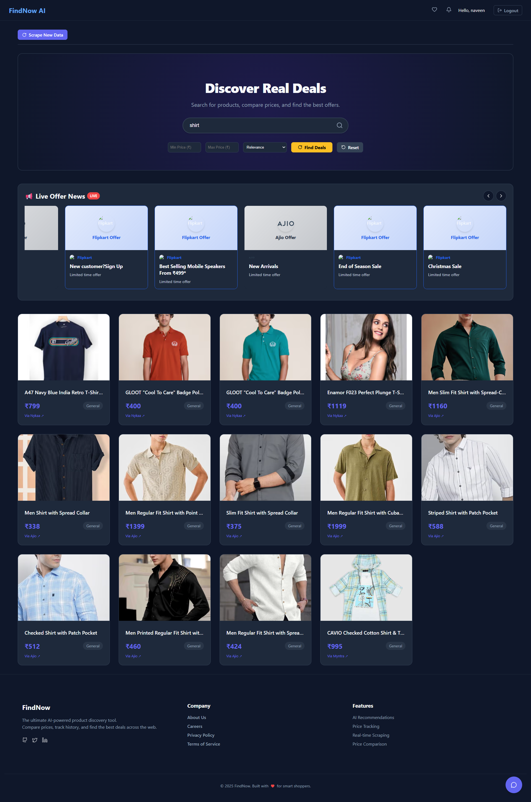
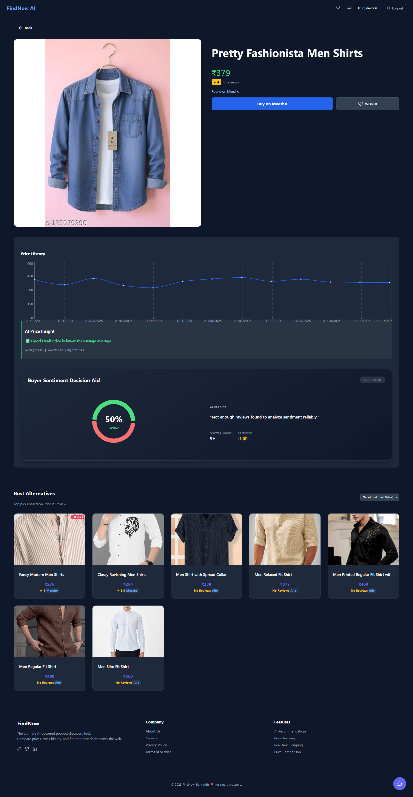
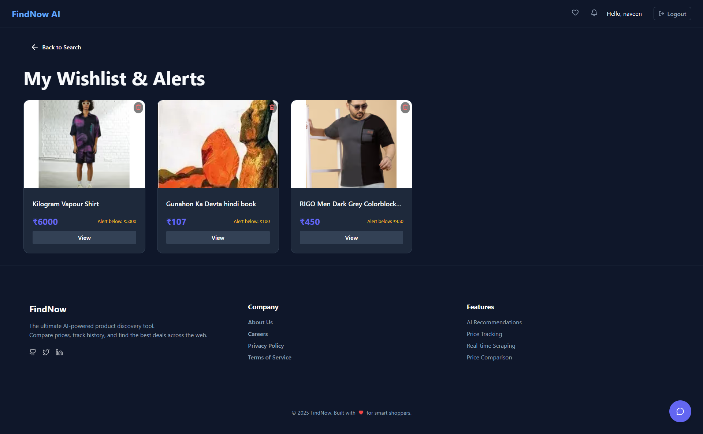
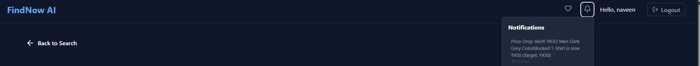
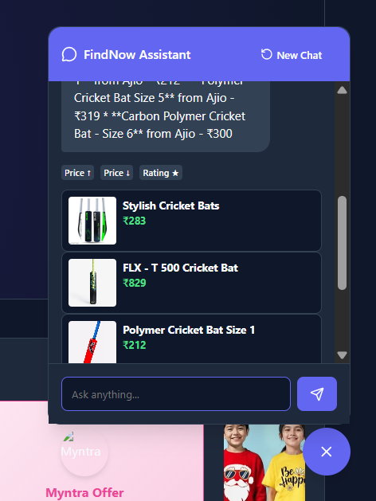

# FindNow - AI-Powered Product Analysis & Comparison

FindNow is a powerful web application that simplifies online shopping decisions. It scrapes product data from various e-commerce platforms, analyzes customer reviews using advanced AI models (Google Gemini / OpenAI), and provides actionable insights, sentiment analysis, and smart product comparisons.

## 🚀 Features

*   **Real-time Product Scraping**: Extracts up-to-date product details, prices, and reviews from major e-commerce sites (e.g., Amazon).
*   **AI Sentiment Analysis**: Uses Large Language Models to analyze customer reviews and generate a "Buy" or "Don't Buy" recommendation with detailed pros and cons.
*   **Smart Comparison**: Compare multiple products side-by-side to find the best value for your money.
*   **Visual Decision Aids**: clear pie charts and summary cards to understand user sentiment at a glance.
*   **Chatbot Assistant**: An intelligent assistant to help guide your search and answer questions about products.

## 🛠️ Tech Stack

### Frontend
*   **React** (via Vite): Fast and modern UI library.
*   **Lucide React**: Beautiful and consistent icons.
*   **Recharts**: For data visualization (sentiment charts).
*   **React Router**: For seamless navigation.

### Backend
*   **Node.js & Express**: Robust server-side framework.
*   **Puppeteer** (with Stealth Plugin) & **Cheerio**: For reliable and efficient web scraping.
*   **Supabase**: For database management and authentication.
*   **Google Generative AI (Gemini) / OpenAI**: For processing natural language and sentiment analysis.

## 📂 Project Structure

```
FindNow/
├── frontend/       # React application (Vite)
│   ├── src/        # UI components, pages, and logic
│   └── ...
├── backend/        # Node.js Express server
│   ├── scraper/    # Web scraping logic
│   ├── routes/     # API endpoints
│   └── ...
└── README.md       # Project documentation
```

## 🏁 Getting Started

### Prerequisites
*   **Node.js** (v18 or higher recommended)
*   **npm** (Node Package Manager)
*   A **Supabase** project (for database credentials)
*   API Keys for **Google Gemini** or **OpenAI**

### Installation

1.  **Clone the repository:**
    ```bash
    git clone <repository-url>
    cd FindNow
    ```

2.  **Install Backend Dependencies:**
    ```bash
    cd backend
    npm install
    ```

3.  **Install Frontend Dependencies:**
    ```bash
    cd ../frontend
    npm install
    ```

### Configuration

Create a `.env` file in the `backend` directory with the following variables:

```env
# Backend .env
PORT=5000
SUPABASE_URL=your_supabase_url
SUPABASE_KEY=your_supabase_anon_key
GEMINI_API_KEY=your_gemini_api_key
# or OPENAI_API_KEY=your_openai_api_key
```

### Running the Application

1.  **Start the Backend Server:**
    ```bash
    cd backend
    npm start
    # or for development with nodemon:
    # npm run dev 
    ```

2.  **Start the Frontend Development Server:**
    ```bash
    cd frontend
    npm run dev
    ```

3.  **Access the App:**
    Open your browser and navigate to the URL provided by Vite (usually `http://localhost:5173`).

## 🤝 Contributing
Contributions are welcome! Please feel free to submit a Pull Request.
Website Image 





