# FindNow — AI-Powered Product Discovery & Price Intelligence


---

## 📖 What is FindNow?

**FindNow** is a full-stack AI-powered product discovery and price intelligence web application. It allows users to search for products across multiple Indian e-commerce platforms (Amazon, Flipkart, Myntra, Ajio, Meesho, Nykaa), compare prices, track price history, analyze customer ratings, and get AI-driven shopping recommendations.

The core idea is to eliminate the time wasted browsing multiple sites. FindNow scrapes live data, stores it in a database with price history, and gives users intelligent tools to make better buying decisions.

---

## ✨ Key Features

| Feature | Description |
|---|---|
| 🔍 **Multi-site Scraping** | Scrapes product listings from Amazon, Flipkart, Myntra, Ajio, Meesho, and Nykaa in real time using headless Chromium |
| 📊 **Price History Charts** | Tracks and visualizes product price over time with interactive area charts |
| 🏷️ **Live Offers Feed** | Continuously polls all 6 platforms for active deals and discount offers in the background |
| 🤖 **AI Chatbot — Search Mode (RAG)** | An embedded chatbot powered by Google Gemini that understands your product database and answers shopping questions using Retrieval-Augmented Generation |
| ⚖️ **AI Chatbot — Comparison Mode** | A dedicated **Compare Mode** inside the chatbot that lets you type any two products (e.g., "iPhone 15 vs Samsung S24") and get an AI-generated side-by-side comparison of specs, price, and value — powered by Google Gemini with live Google Search grounding for up-to-date data |
| ⭐ **Customer Rating Distribution** | Scrapes rating breakdowns (1★–5★) from product pages with multi-strategy fallback |
| 💡 **Price Intelligence Gauge** | Compares the current price against historical min/max and average; shows AVG marker and date bubble on a color-coded bar |
| 🔔 **Wishlist & Price Alerts** | Users can add products to a wishlist with a target price; the backend periodically checks and notifies them when the price drops |
| 🌙 **Light / Dark Theme** | Full theme system using CSS custom variables, persisted in localStorage |
| 🔐 **Authentication** | JWT-based user registration and login |

---

## 🛠️ Technology Stack

### Frontend
| Technology | Role |
|---|---|
| **React 18** | UI component framework |
| **Vite** | Dev server and build tool (HMR support) |
| **React Router DOM** | Client-side routing (SPA navigation) |
| **Recharts** | Interactive charts (price history area chart) |
| **Lucide React** | Icon library |
| **Vanilla CSS + CSS Variables** | Global theming system (light/dark mode) |

### Backend
| Technology | Role |
|---|---|
| **Node.js + Express** | REST API server |
| **Puppeteer + Stealth Plugin** | Headless browser for scraping JS-rendered pages and bypassing bot detection |
| **Cheerio** | Lightweight HTML parsing for scraping static content |
| **Supabase (PostgreSQL)** | Persistent database for products, price history, users, wishlists, notifications |
| **`@supabase/supabase-js`** | Supabase client SDK |
| **Google Gemini API** | AI model (`gemini-2.5-flash`, `gemini-2.5-pro`) for Chatbot and sentiment analysis |
| **`text-embedding-004`** | Gemini embedding model for converting product text into vector embeddings |
| **JWT + bcryptjs** | Authentication (token-based login, hashed passwords) |
| **dotenv** | Environment variable management |

---

## 📂 Project Structure

```
FindNow/
│
├── frontend/                        # React SPA
│   └── src/
│       ├── pages/
│       │   ├── Home.jsx             # Main search/filter/product grid page
│       │   ├── ProductDetail.jsx    # Individual product with price chart & AI analysis
│       │   ├── Wishlist.jsx         # Saved products with price alert tracking
│       │   ├── Login.jsx            # User login
│       │   └── Register.jsx         # User registration
│       ├── components/
│       │   ├── Navbar.jsx           # Top navigation + theme toggle
│       │   ├── PriceChart.jsx       # Price history chart + AI price verdict
│       │   ├── ChatWidget.jsx       # Floating AI chatbot widget
│       │   └── OfferFeed.jsx        # Live deals/offers carousel
│       ├── context/
│       │   ├── AuthContext.jsx      # JWT user session context
│       │   └── ThemeContext.jsx     # Light/Dark theme context
│       ├── api.js                   # All frontend ↔ backend API calls
│       ├── App.jsx                  # Route definitions
│       ├── App.css                  # All themed component styles
│       └── index.css                # Global CSS variables (light/dark tokens)
│
└── backend/                         # Node.js + Express REST API
    ├── server.js                    # Entry point — registers routes, starts server
    ├── routes/
    │   ├── products.js              # GET/POST products, trigger scrape
    │   ├── auth.js                  # Register / Login (JWT)
    │   ├── wishlist.js              # Add/remove wishlist items, set price alerts
    │   ├── chat.js                  # RAG chatbot endpoint
    │   ├── analyze.js               # Ratings scrape + sentiment analysis
    │   ├── notifications.js         # Fetch user notifications
    │   └── offers.js                # Live offer feed polling
    ├── scraper/
    │   ├── index.js                 # Main scraper — multi-site product data extraction
    │   ├── reviewScraper.js         # Scrapes rating distributions + review text
    │   └── offerScraper.js          # Scrapes live deals/offers from all 6 platforms
    ├── services/
    │   ├── dbService.js             # All database logic (products, history, users, wishlist)
    │   ├── embeddingService.js      # Converts text → vector embeddings (Gemini)
    │   ├── ragService.js            # Retrieval-Augmented Generation for chatbot
    │   ├── sentimentService.js      # AI sentiment analysis using Gemini
    │   └── notificationService.js   # Background price-drop monitoring
    └── utils/                       # Shared utility helpers
```

---

## 🔄 How the Project Works (Flow)

> This section describes the complete flow of data and interactions, designed to help you draw a project flow diagram.

### 1. User Authentication Flow
```
User → Register/Login Page
     → POST /api/auth/register or /login
     → Backend hashes password (bcryptjs), stores in Supabase `users` table
     → Backend returns JWT token
     → Frontend stores token in localStorage
     → AuthContext provides `user` state globally
```

### 2. Product Scraping Flow
```
User → Clicks "Scrape New Data" on Home Page
     → Frontend calls POST /api/products/scrape { query }
     → Backend's scraper/index.js launches Puppeteer (headless Chromium)
     → Puppeteer visits Amazon, Flipkart, Myntra, Ajio, Meesho, Nykaa
     → Extracts: title, price, image_url, rating, product_url, source
     → For each product:
         → embeddingService generates a vector embedding using Gemini `text-embedding-004`
         → dbService saves product + embedding to Supabase `products` table
         → dbService logs the current price to `price_history` table
     → Backend returns scraped products array
     → Frontend updates product grid
```

### 3. Product Filtering Flow (Home Page)
```
User → Types in search bar / changes Min/Max Price / changes Sort
     → React state updates (searchTerm, minPrice, maxPrice, sortBy)
     → useMemo re-filters the already-loaded product array in memory
     → Filtered + sorted product grid re-renders instantly
     → No network request is made (client-side only)
```

### 4. Product Detail & Price History Flow
```
User → Clicks a product card
     → Navigates to /product/:id
     → Frontend calls GET /api/products/:id
     → Backend fetches product + price_history from Supabase
     → Frontend renders:
         → Product image, title, price, description
         → PriceChart component renders area chart from price_history
         → AI Verdict: compares currentPrice vs historical avg/min/max
         → Shows color-coded gauge with AVG marker + today's date bubble
         → Smart Buying Guide: ranks best months to buy
```

### 5. Customer Ratings Flow
```
User → Clicks "Fetch Real-Time Ratings" on product page
     → Frontend calls POST /api/analyze/ratings { product_url, rating }
     → reviewScraper.js launches Puppeteer on the product URL
     → Strategy waterfall:
         1. Intercepts XHR/JSON API responses containing rating data
         2. Parses application/ld+json structured data
         3. DOM extraction with site-specific CSS selectors
         4. ld+json aggregate score → estimated distribution
         5. Regex pattern matching on page text
         6. Fallback: uses known `rating` from database → estimateDistribution()
     → Returns { 5: {count, percentage}, 4: ..., 3: ..., 2: ..., 1: ... }
     → Frontend renders animated progress bars
```

### 6. AI Chatbot Flow (RAG — Search Mode & Compare Mode)

The chatbot has **two distinct modes** switchable from tabs inside the widget:

#### 6a. Search Mode (default)
```
User → Switches to "Search Mode" tab in ChatWidget
     → Types a product query (e.g. "best running shoes under 3000")
     → Frontend calls POST /api/chat { query, mode: 'search', history }
     → ragService.js:
         1. Converts user message to a vector embedding (embeddingService → Gemini text-embedding-004)
         2. Queries Supabase for the most semantically similar products
            (pgvector similarity search with threshold 0.5, top 5 results)
         3. If fewer than 3 results found → triggers a LIVE SCRAPE automatically
            (scraper/index.js → saves to DB → returns fresh products)
         4. Builds a context prompt with matched/scraped products
         5. Sends prompt + context to Gemini API (gemini-2.5-flash)
         6. Gemini generates a friendly product recommendation response
         7. Falls back to gemini-2.5-pro on 404/503/429 errors with retry
     → Frontend displays AI response in chat bubble (rendered as Markdown)
     → Product cards also render inline with sort-by-price / sort-by-rating controls
```

#### 6b. Compare Mode (NEW ✨)
```
User → Switches to "Compare Mode" tab in ChatWidget
     → Types a comparison query (e.g. "iPhone 15 vs Samsung S24")
     → Frontend calls POST /api/chat { query, mode: 'compare', history }
     → ragService.js:
         1. Skips database/embedding search (uses live Google Search instead)
         2. Attaches { googleSearch: {} } tool to the Gemini model call
            → Gemini grounds its response in real-time Google Search results
         3. Sends a structured comparison prompt to gemini-2.5-flash:
              a. Comparison: specs, features, price, real-world value
              b. Counter Questions: asks 1–2 follow-up questions to refine advice
              c. Final Suggestion: definitive buy/skip recommendation
         4. ALWAYS uses Indian Rupees (₹/INR); never USD
         5. Falls back to gemini-2.5-pro on API errors with retry
     → Frontend renders the Markdown response with table formatting
     → Chat history is maintained across turns for context-aware follow-ups
```

### 7. Live Offers Feed Flow
```
Server starts → Background interval triggers every 10 minutes
     → offerScraper.js visits each platform's deals/offers page
     → Extracts: offer title, discount, image, link, source
     → Falls back to curated static offers if scraping fails
     → Stores results in memory (in-process cache)
     → GET /api/offers returns the cached offer list
     → Frontend OfferFeed component displays a scrolling carousel
```

### 8. Wishlist & Price Alert Flow
```
User → Clicks heart icon on product detail page
     → Sets a target price in the modal
     → POST /api/wishlist/add { product_id, desired_max_price }
     → dbService saves to Supabase `wishlists` table
     → Backend notificationService runs a background check periodically:
         → Fetches all wishlists from DB
         → For each item, fetches the latest scraped price
         → If currentPrice <= desired_max_price:
             → Creates a notification in `notifications` table
     → User checks Wishlist page → GET /api/notifications
     → Frontend shows price drop alerts
```

---

## 🚀 How to Use the Project After Running

Once both servers are running (`node server.js` in `/backend` and `npm run dev` in `/frontend`), open **http://localhost:5173** and follow this guide:

### Step 1 — Register / Log In
- Go to **Register** (top-right) → enter your email and password → click **Register**.
- Or click **Login** if you already have an account.
- After login, your name appears in the navbar and all personalised features (wishlist, alerts) are unlocked.

### Step 2 — Search for Products
- On the **Home** page, type a product name in the search bar (e.g., `laptop` or `Nike shoes`).
- Click **Scrape New Data** to trigger a live scrape across Amazon, Flipkart, Myntra, Ajio, Meesho, and Nykaa.
- Products load into the grid within seconds.

### Step 3 — Filter & Sort Results
- Use the **Min Price / Max Price** inputs to narrow the price range.
- Use the **Sort** dropdown (Price ↑, Price ↓, Rating) to reorder — all filtering is instant and happens client-side.

### Step 4 — View Product Details
- Click any product card to open the **Product Detail** page.
- You'll see:
  - The product image, title, current price, source platform, and rating.
  - An **interactive price history chart** (area chart) showing how the price has changed over time.
  - A **Price Intelligence Gauge** — color-coded bar comparing current price to historical min/avg/max with an AVG marker.
  - A **Smart Buying Guide** scoring each month for the best time to buy.

### Step 5 — Fetch Real-Time Customer Ratings
- On the Product Detail page, click **Fetch Real-Time Ratings**.
- The app scrapes the actual product page (Amazon/Flipkart/etc.) and shows an animated **1★ – 5★ rating distribution** breakdown.

### Step 6 — Use the AI Chatbot (Search Mode)
- Click the **chat bubble button** (bottom-right corner of any page).
- Make sure you are on the **Search Mode** tab (blue, default).
- Ask anything, e.g.: *"Show me the best wireless earbuds under ₹2000"*.
- The bot will retrieve products from the database (or scrape live if needed) and give a formatted recommendation.
- Products appear as **inline clickable cards** below the response — you can sort them by price or rating.

### Step 7 — Use the AI Chatbot (Compare Mode — NEW ✨)
- Inside the chat widget, click the **Compare Mode** tab (green).
- Type a comparison like: *"Compare OnePlus 12 vs iQOO 12"* or *"Samsung 65" QLED vs LG OLED"*.
- The AI uses **Google Search grounding** to fetch live specs and prices and returns:
  1. A structured **Comparison table** (specs, features, price, value).
  2. **Follow-up questions** to understand your specific needs (budget, use-case).
  3. A **clear buy/skip recommendation** in Indian Rupees (₹).
- You can continue the conversation — the bot remembers previous messages in the same session.
- Use the **New Chat** button to reset the conversation.
- Use the **Expand** button to open the chat in a wide-screen view for easier reading of comparison tables.

### Step 8 — Add to Wishlist & Set Price Alerts
- On the Product Detail page, click the **heart icon** (❤️).
- Enter your **target price** (the price you want to be notified at).
- Click **Set Alert**.
- The backend will periodically check the latest scraped price for that product.
- When the price drops to your target or below, a **notification** is created.
- Check your alerts on the **Wishlist** page (link in navbar).

### Step 9 — Browse Live Offers
- The **OfferFeed carousel** on the Home page auto-refreshes every 10 minutes with the latest deals from all 6 platforms.
- Click any offer card to go directly to the deal page.

### Step 10 — Toggle Dark / Light Mode
- Click the **moon/sun icon** in the navbar to switch between dark and light themes.
- Your preference is saved in `localStorage` and persists across sessions.

---

## simple flowchart


## ⚙️ Environment Variables

### Backend (`backend/.env`)
```env
PORT=5000
SUPABASE_URL=your_supabase_project_url
SUPABASE_KEY=your_supabase_anon_key
GEMINI_API_KEY=your_google_gemini_api_key
JWT_SECRET=your_jwt_secret_string
```

### Frontend (`frontend/.env`)
```env
VITE_API_URL=http://localhost:5000/api
```

---

## 🏁 Getting Started

### Prerequisites
- **Node.js** v18+
- **npm**
- A **Supabase** project (free tier works)
- A **Google Gemini API** key (from [Google AI Studio](https://aistudio.google.com/))

### Installation

```bash
# 1. Clone the repo
git clone https://github.com/Bhartinaveen/Findone.git
cd FindNow

# 2. Backend
cd backend
npm install
# Create backend/.env and fill in the values above
node server.js

# 3. Frontend (new terminal)
cd frontend
npm install
# Create frontend/.env and fill in the values above
npm run dev
```

Open **http://localhost:5173** in your browser.

---

## 🗄️ Database Schema (Supabase / PostgreSQL)

| Table | Key Columns | Purpose |
|---|---|---|
| `products` | id, title, price, image_url, product_url, source, rating, embedding (vector 768) | Scraped product catalog |
| `price_history` | id, product_id, price, recorded_at | Time-series price tracking |
| `users` | id, email, password_hash | Authentication |
| `wishlists` | id, user_id, product_id, desired_max_price | Price alert subscriptions |
| `notifications` | id, user_id, product_id, message, is_read, created_at | Price drop alerts |

---

<p align="center">Made with ❤️ by <a href="https://github.com/Bhartinaveen">Bharti Naveen</a></p>
<p align="center">New Collaboration ❤️ by <a href="https://github.com/abhisura7890">Abhishek Sharma</a></p>

# How this project looks
# login page
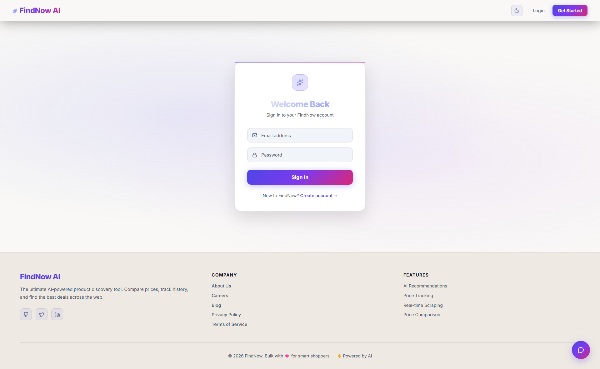
# Register page
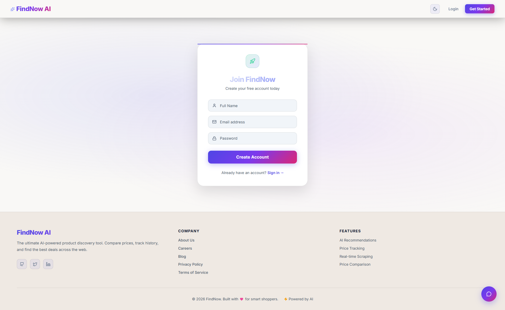
# main page 

# chatbot page and you can adjust the price range and rating according to your need by using up and down arrow keys
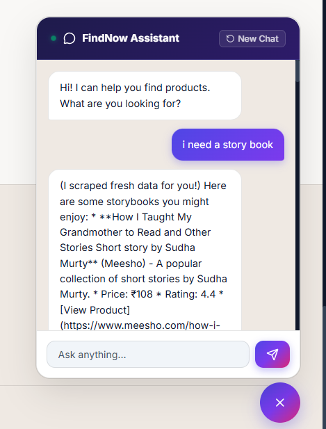
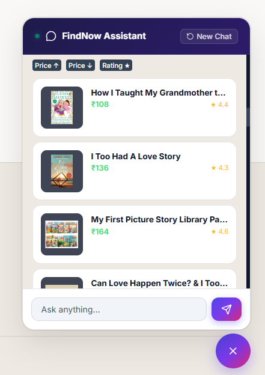

# product detail page
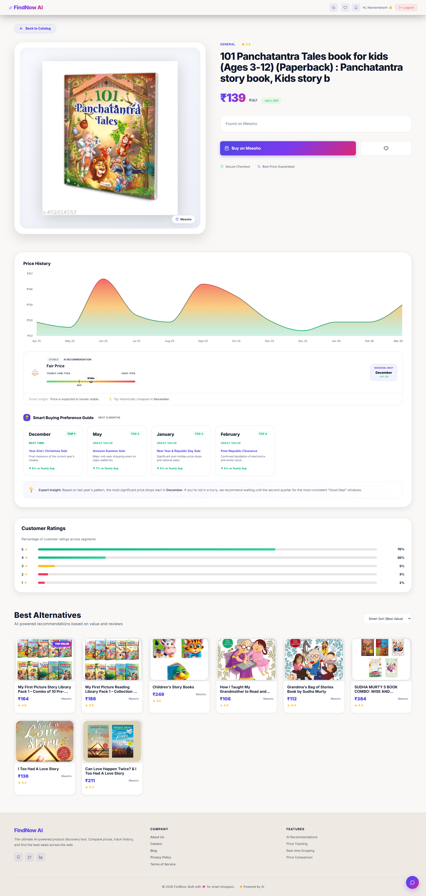
# Blog details page
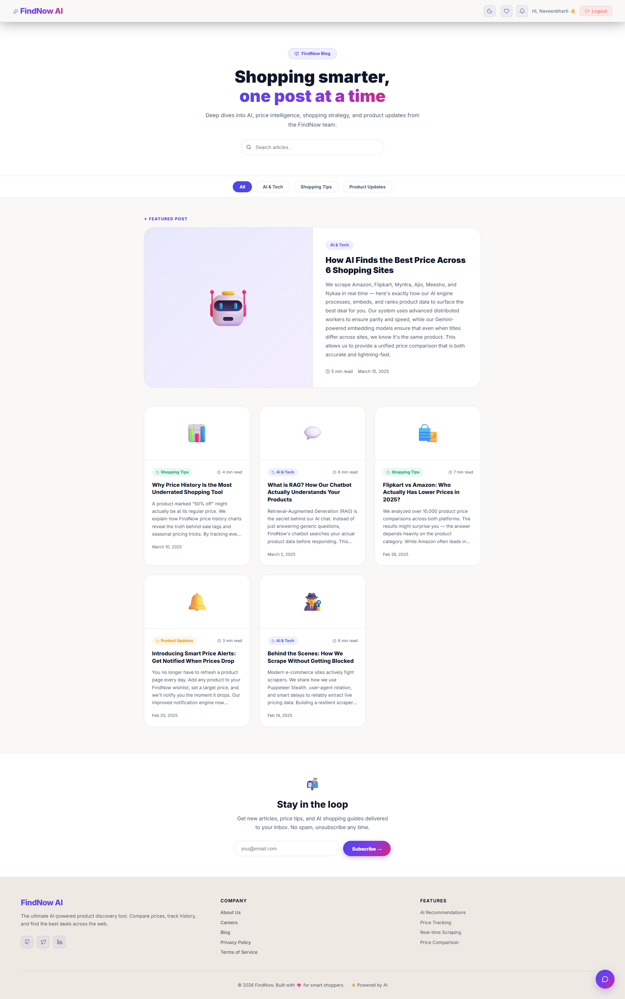
# About us page
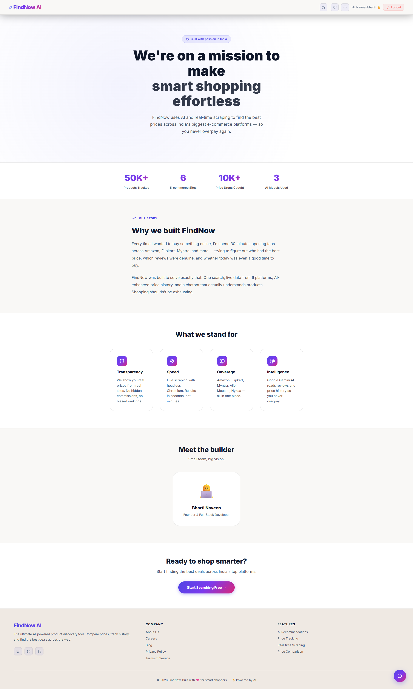
# privacy policy page
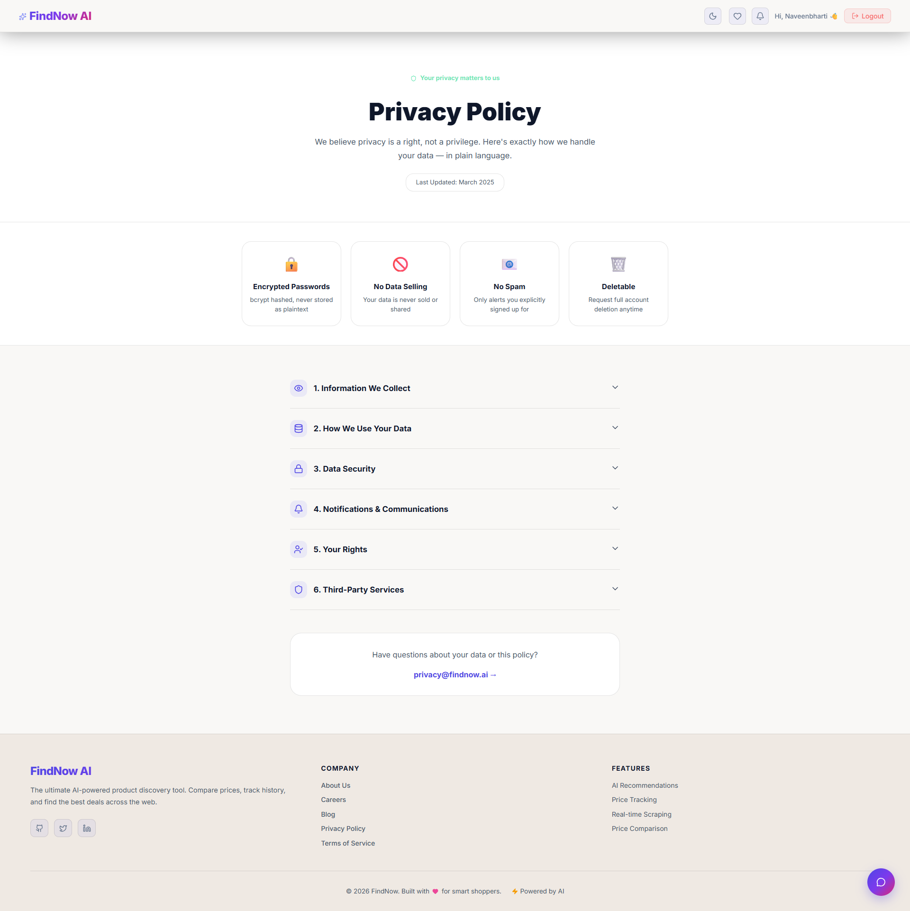
# Terms and comdition 
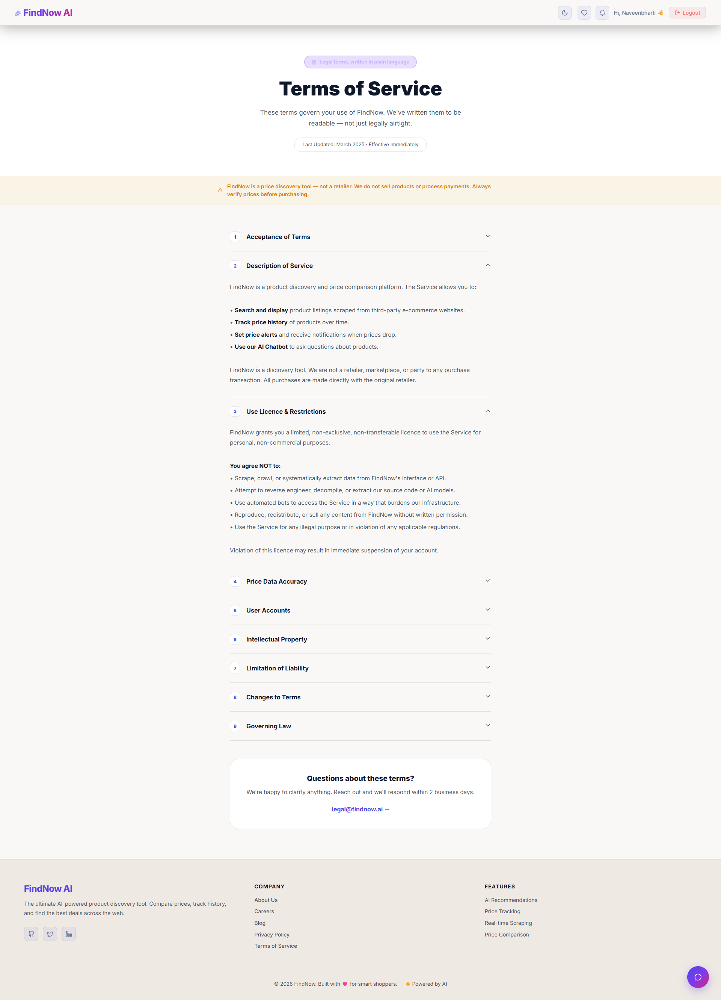

# My career page
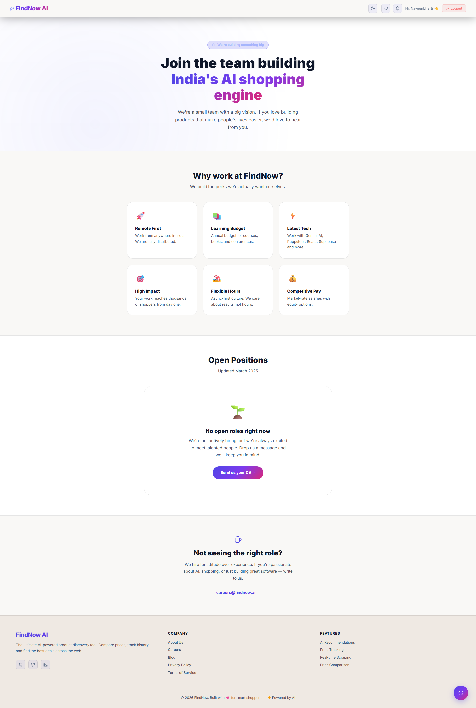

# Have a two mode dark mode and light mode
# Light mode
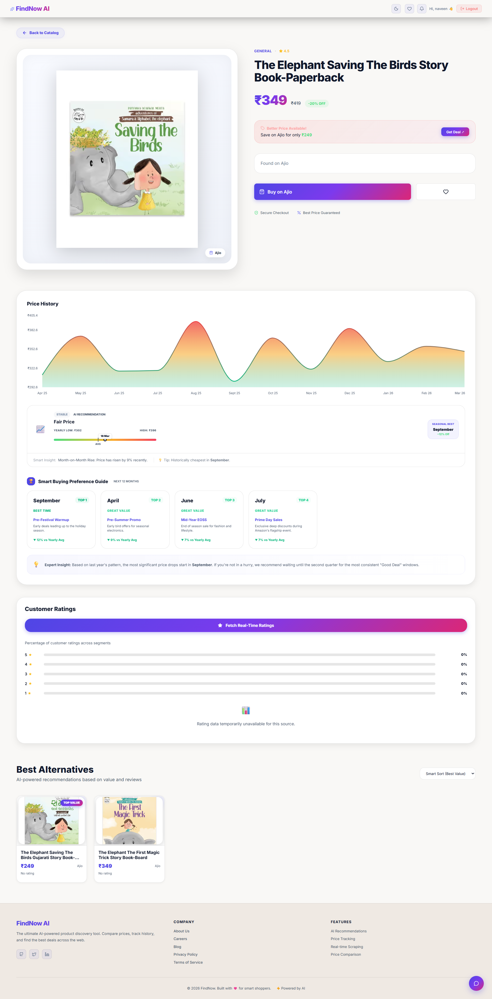
# Dark mode
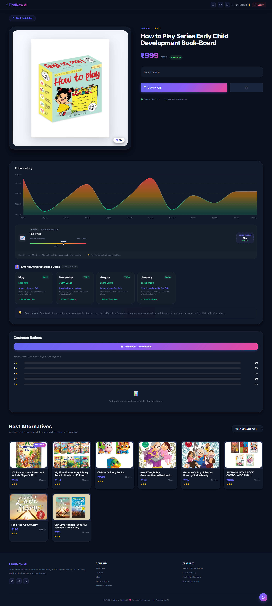

